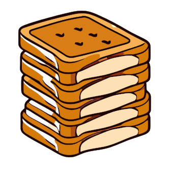

# 🍞 react-stacked-toast

<!-- [](https://www.npmjs.com/package/react-stacked-toast)
[](https://www.npmjs.com/package/react-stacked-toast)
[](https://www.npmjs.com/package/react-stacked-toast) -->

<div style="text-align: center">
  
</div>

## 🔥 Features

- 📦 **Tiny**: ~6kB gzipped

- 🎨 **Customizable**: You can customize the toast notification by passing a React component

## 🏃 Getting started

Using npm:

```console
npm i react-stacked-toast
```

Using yarn:

```console
yarn add react-stacked-toast
```

## 📚 Usage

### 1. Add the `Toaster` component to the your application

```tsx
import { Toaster } from 'react-stacked-toast';

const App = () => {
  return (
    <Toaster />
    // Other components
  );
};
```

### 2. Use the `toast` api to create a toast anywhere in your application

```tsx
import { toast } from 'react-stacked-toast';

const Component = () => {
  return (
    <button
      onClick={() => {
        toast({
          title: 'React Stacked Toast',
          description: 'Here is your toast!',
        });
      }}
    >
      Show toast
    </button>
  );
};
```

## 🔧 API

<!-- Find the full API reference on [official documentation](https://updatelater). -->

Update later

## Acknowledgements

This project is inspired by [react-hot-toast](https://github.com/timolins/react-hot-toast)

## LICENSE

License under [MIT](./LICENSE)
