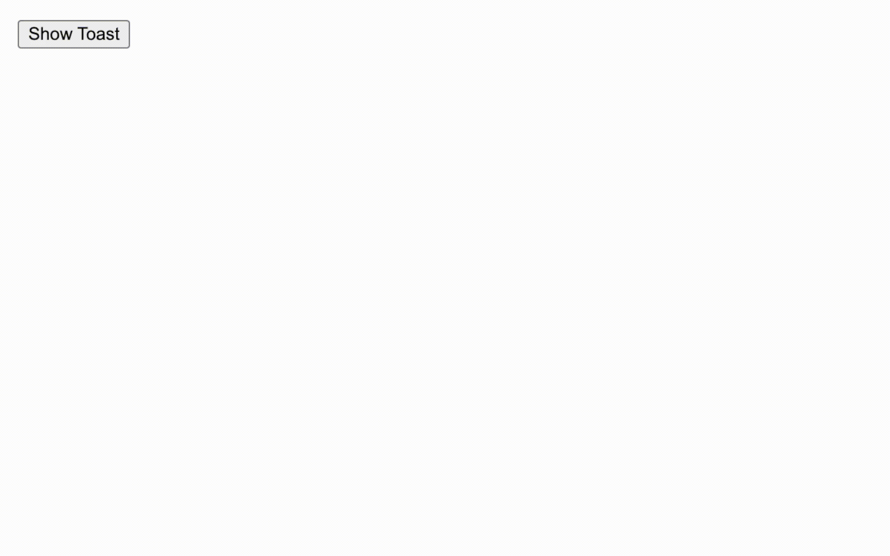

# 📦 react-stacked-toast

A simple stacked toast notification component for React.



## 🏃 Getting started

```console
npm i react-stacked-toast
```

or

```console
yarn add react-stacked-toast
```

## Usage

### 1. Add the `Toaster` component to the root of your app

```tsx
import { Toaster } from 'react-stacked-toast';

const App = () => {
  return (
    // Other components
    <Toaster />
  );
};
```

### 2. Use the `useToast` hook to create a toast

```tsx
import { useToast } from 'react-stacked-toast';

const Component = () => {
  const toast = useToast();

  const handleClick = () => {
    toast({
      title: 'Hello world!',
      description: 'This is a toast notification.',
    });
  };

  return <button onClick={handleClick}>Show toast</button>;
};
```

## LICENSE

[MIT](./LICENSE)
